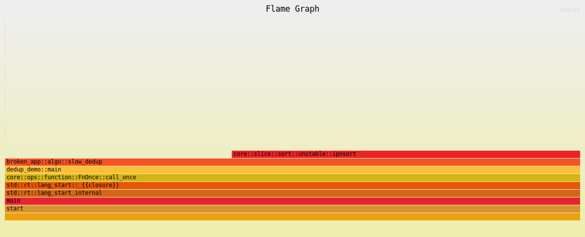
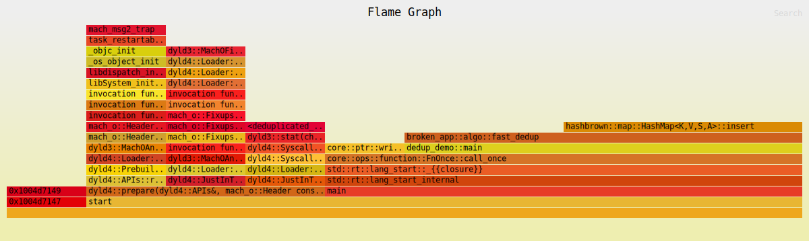

# Broken-app
##  What was done

- Fixed obvious bugs using the IDE (RustRover) debugger
  - step into / step over
  - added tests
- Found and fixed undefined behavior (Miri)
- Algorithmic issues have been fixed
  - `flamegraph` - look for bottlenecks (a large number of stack appearances 
  or a large number of memory allocations)
  - `criterion` - check the found location with performance tests
  - checked business logic via unit testsc
- Fixed concurrent execution issues (without debugging, reason below)
  
##  Artifacts
- [cargo_test_before.txt](artifacts/cargo_test_before.txt) - demonstration of test execution 
  before carrying out the work
- [cargo_test_after.txt](artifacts/cargo_test_after.txt) - demonstration of test execution 
  after the work has been carried out
- [bench_dedup.txt](artifacts/bench_dedup.txt) - comparison of the function execution
time before and after modifications (dedup function)
- [bench_fib.txt](artifacts/bench_fib.txt) - the same for the fib-function
- [cargo_miri_test_before.txt](artifacts/cargo_miri_test_before.txt) - identifying places with undefined behavior ()
- [cargo_miri_test_after.txt](artifacts/cargo_miri_test_after.txt) - demonstration of successful 
correction of undefined behavior
-  - 
visualization of code problems (problem with sorting)
-  - 
visualization with evidence of successful work
  - there is no single dominant "plateau" that is used by almost the entire CPU.
  - the work is distributed among several narrow sections of the standard library.

## Problems at work (macOS)
- ASan/TSan - failed to install
- Valgrind - failed to install