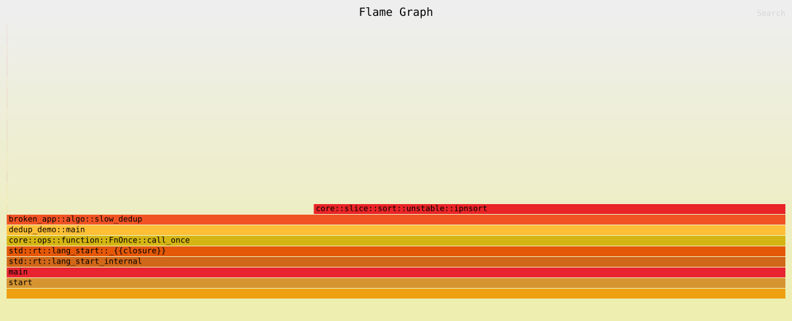
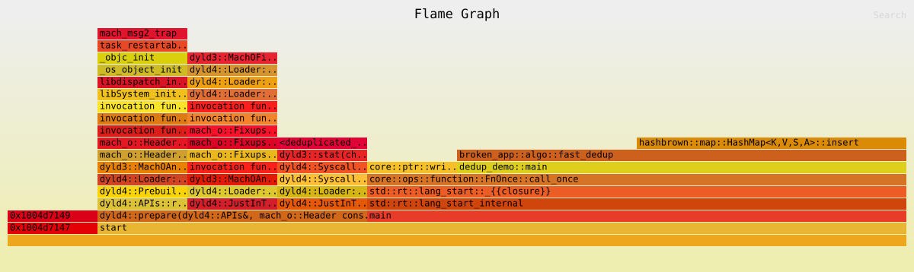

# Broken-app
##  What was done

- Fixed obvious bugs using the IDE (RustRover) debugger
  - step into / step over
  - added tests
- Fixed array out of bounds (Sanitizers)
- Found and fixed undefined behavior (Miri)
- Algorithmic issues have been fixed
  - `flamegraph` - look for bottlenecks (a large number of stack appearances 
  or a large number of memory allocations)
  - `criterion` - check the found location with performance tests
  - checked business logic via unit testsc
- Fixed concurrent execution issues (without debugging, reason below)
  
##  Artifacts
- [asan_before.txt](artifacts/asan_before.txt) - demonstration of A-sanitizer execution
  a carrying out the work
- [asan_after.txt](artifacts/asan_after.txt) - demonstration of A-sanitizer execution
    after the work has been carried out
- [tsan_before.txt](artifacts/tsan_before.txt) - demonstration of T-sanitizer execution
  a carrying out the work
- [tsan_after.txt](artifacts/tsan_after.txt) - demonstration of T-sanitizer execution
    after the work has been carried out
- [cargo_test_before.txt](artifacts/cargo_test_before.txt) - demonstration of test execution 
  before carrying out the work
- [cargo_test_after.txt](artifacts/cargo_test_after.txt) - demonstration of test execution 
  after the work has been carried out
- [bench_dedup.txt](artifacts/bench_dedup.txt) - comparison of the function execution
time before and after modifications (dedup function)
- [bench_fib.txt](artifacts/bench_fib.txt) - the same for the fib-function
- [cargo_miri_test_before.txt](artifacts/cargo_miri_test_before.txt) - identifying places with undefined behavior ()
- [cargo_miri_test_after.txt](artifacts/cargo_miri_test_after.txt) - demonstration of successful 
correction of undefined behavior
-  - 
visualization of code problems (problem with sorting)
-  - 
visualization with evidence of successful work
  - there is no single dominant "plateau" that is used by almost the entire CPU.
  - the work is distributed among several narrow sections of the standard library.

## Problems at work (macOS)
- Valgrind - failed to install

## Additional info
### How to start sanitizers
- `brew install llvm`
- `brew install lld`
- `.cargo/config.toml`
```toml
[target.aarch64-apple-darwin]
rustflags = ["-C", "link-arg=-fuse-ld=/opt/homebrew/opt/lld/bin/ld64.lld"]
```
#### TSan
```rust
RUSTFLAGS="-Zsanitizer=thread" cargo +nightly -Z build-std test --target aarch64-apple-darwin --tests
```
#### ASan
```rust
RUSTFLAGS="-Zsanitizer=address" cargo +nightly test --target aarch64-apple-darwin
```